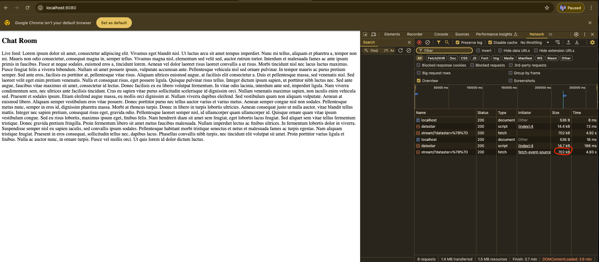

## Datastar Noob Question
### How can I get a ChatGPT like UI using datastar without sending the entire page in each fragment?


### Setup

Install FastAPI via pip:
```bash
pip install -r requirements.txt
```

Start fastapi server:
```bash
fastapi dev app.py --port 8000
```

Then navigate to localhost:8000

You should see this:



Where lorem ipsum is generated using server sent events powered by datastar on the frontend. The issue I have is that I could not get this to work by only sending individual words via `data: merge append_element`

As a result, just this example ends up taking 700kb in bandwidth just to send over lorem ipsum. This is because this sends the entirety of the text each time just to add a single word.


So then on the `append` branch (`git checkout append`) I try to avoid this by using the `data: merge append_element`. Which sort of works in that my bandwidth being used is much lower, however, it ends up almost crashing my browser and being very choppy.
